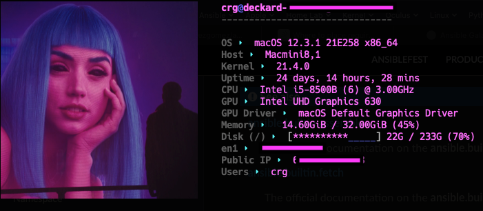
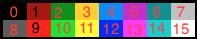

Neofetch Templater
=========

Configure and deploy Neofetch configurations with ansible.

Requirements
------------

Neofetch must be installed separately. This role doesn't install neofetch directly.

Role Variables
--------------

See defaults/main.yml for all the variables to override. These are all taken from the neofetch configuration, with helpful comments on what values are valid.

Example Playbook
----------------

    - hosts: localhost
      roles:
        - role: neofetch-templater
          neofetch_print_info:
            - name: "title"
            - name: "underline"
            - name: "prin"
            - name: "distro"
              display_name: "OS"
            - name: "model"
              display_name: "Host"
            - name: "kernel"
              display_name: "Kernel"
            - name: "uptime"
              display_name: "Uptime"
            - name: "cpu"
              display_name: "CPU"
            - name: "gpu"
              display_name: "GPU"
            - name: "gpu_driver"
              display_name: "GPU Driver"
            - name: "memory"
              display_name: "Memory"
            - name: "cpu_usage"
              display_name: "CPU Usage"
            - name: "disk"
              display_name: "Disk"
            - name: "local_ip"
              display_name: "Local IP"
            - name: "public_ip"
              display_name: "Public IP"
            - name: "users"
              display_name: "Users"
          neofetch_local_ip_interface:
            - "en1"
          neofetch_image_backend: "iterm2"
          neofetch_bar_color_elapsed: "5"
          neofetch_bar_color_total: "4"
          neofetch_colors:
            distro: no
            title: 5
            at: 4
            underline: 8
            subtitle: 0
            colon: 14
            info: 13
          neofetch_ascii_colors:
            - 0
            - 4
            - 5
            - 6
            - 8
            - 12
            - 13
            - 14
          neofetch_image: "files/joi.png"
          neofetch_separator: "  "
          neofetch_crop_mode: "fit"
          neofetch_crop_offset: "center"
          neofetch_gap: "5"
          neofetch_image_size: "25%"

Color Codes
----------------

License
-------

MIT

